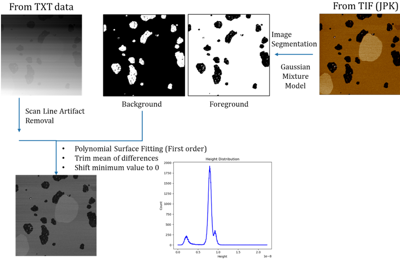
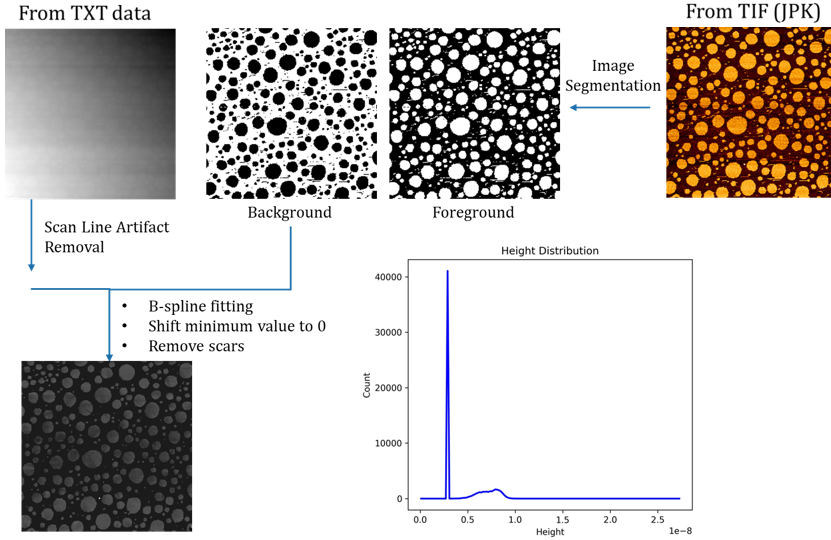
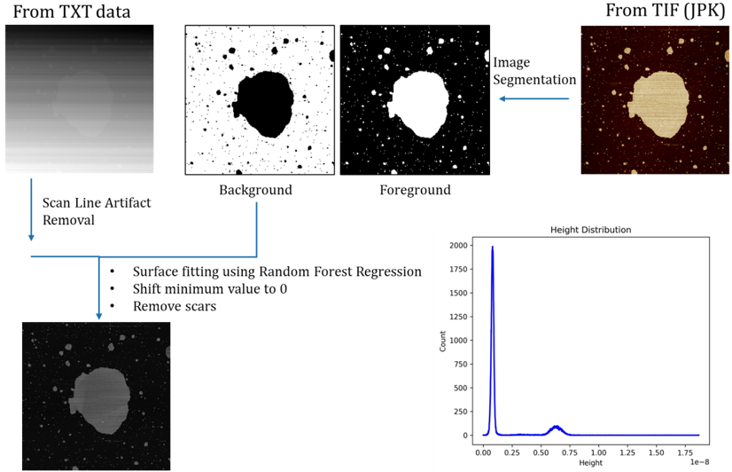
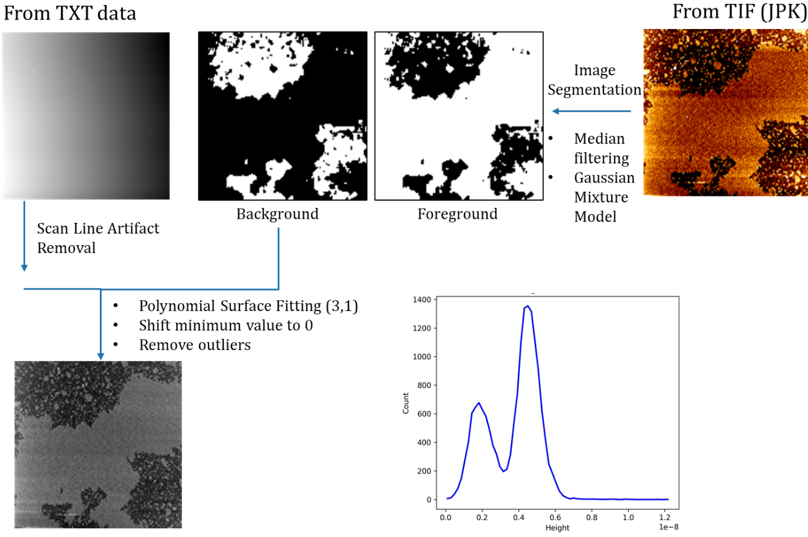

# AFM image processing and analysis
Python workflow for correcting artefacts and tilted background from AFM image data

## Project Title
```
IDP30| DyNaMo | Measuring lipid bilayers height with accuracy 
```
## Installation

(Recommend) Create a conda environment:

    conda create -n afmprocessing python=3.11
    conda activate afmprocessing

Install the main project

    pip install git+https://github.com/ledvic/AFM-leveling.git#egg=afmprocessing

To update latest development version :

    conda activate afmprocessing
    pip install -U git+https://github.com/ledvic/AFM-leveling.git#egg=afmprocessing

## Use Cases

1. Performance of the workflow on the data where the portion of background is smaller than of foreground which includes two distinct layers.

    

2. Performance of the workflow on the data where foreground is a set of many small patches. This test shows the potential of the B-spline surface fitting for leveling the data. 

    

3. Performance of the workflow on the data where foreground is a set of many small patches. This test shows the potential of the B-spline surface fitting for leveling the data. 

    

4. Performance of the workflow on the data where data is noisy and contains outliers.

    
